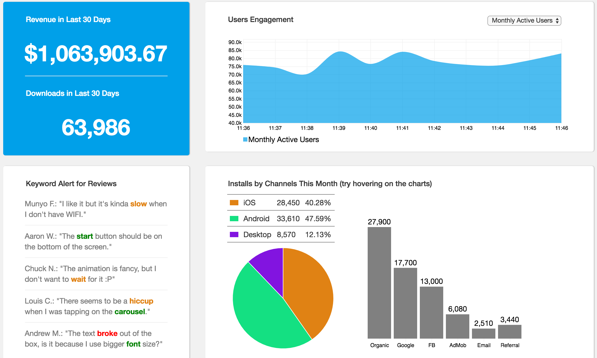
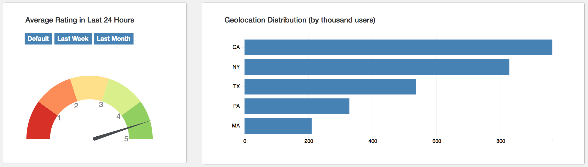
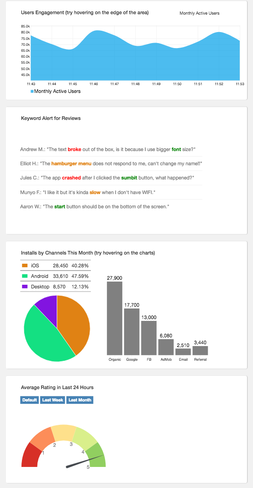

# App Sentinel

[Take a look at App Sentinel](https://kevinshenyang07.github.io/AppSentinel/)

Since I used to be a data analyst, I always hold a passion to create a dashboard that looks clean but contains large amount of information at different level.

All the mobile companies understand the performance of their apps are critical to their success. The growth hackers care a lot about user activities, the marketeers care a lot about cost/downloads efficiency, and the engineers care a lot about high availability and low latency. App Sentinel is a dashboard that is designed to visualize the most important metrics for one of those domains. In this case, the choice is growth hacking.

First four visualizations:



Fifth and sixth visualizations:



Also support mobile:




### Features and Implementation

App Sentinel is a front-end project, but it's designed to be able to be plugged into a live data feed from back-end easily. All visualizations ingest JSON data and have no dependencies on the back-end. To emulate that process it uses randomly generated data.

Each visualzation is designed to present different levels of details interactively. The goal is to provide as much as information the user would need, but at the same time keep the visualization clean and organized.

One might be wondering why I want to add live reviews on the dashboard, it is for reason: users are the best testers for our apps, and their feedbacks will keep surprising our product managers. With a text classification model at the backend, I would be able to select the reviews that might helps most and highlight them to the viewers, which also saves hours of time for product managers to go through the reviews themselves.

#### Visualization for User Engagement

This is the most challenging one, and also most representative of D3's features. To be able to take in different number of data points and dynamically adjust the area and x axis. By using D3's enter-join-exit mechanism, one can declare the data join pattern first then push the data to the chart later.

Below is a code snippet for dynamically updating toolips points:

```JavaScript
// data enter and join
points.selectAll(".usertipPoints")
      .data(ddata)
      .enter().append("circle")
      .attr("class", "usertipPoints")
      .attr("cx", d => x(d.time))
      .attr("cy", d => y(d[option]))
      .attr("r", "6px");

// data exit
points.selectAll(".usertipPoints")
      .data(ddata)
      .exit()
      .transition()
      .duration(200)
      .remove();
```

#### Visualization for Installs By Channels

This one is an attempt to create a dashboard with charts being aware of other charts' update. In this case I used `createView()` as a closure for all the chart-creating functions, but the data flow can be better managed in flux patterns.

To make the two charts interacting with each other, I wrote a update method for each chart that can either update or reset based on the input, below is the code snippet to illustrate this pattern:

```JavaScript
function mouseover(d) {
  const singleChannelData = data.filter(s => s.channel === d[0])[0];
  // for each single channel, get installs by platform
  const nd = d3.keys(singleChannelData.platform).map(
    s => ({type:s, platform: singleChannelData.platform[s]})
  );

  pieChart.update(nd);
  legend.update(nd);
};

function mouseout(d) {
  // reset the pie-chart and legend.
  pieChart.update(totalByPlatform);
  legend.update(totalByPlatform);
};
```

### Architecture and Technologies

This project will be implemented with the following technologies:

- Vanilla JavaScript combined with `jQuery` for basic DOM manipulation and event handling.
- `D3.js` for constructing each visualization component.
- `Bootstrap` for making this app responsive.

File structure:

-- docs

-- lib (including main.js and other components)

-- application.css

-- index.html


### Bonus features

There are many directions this dashboard app could eventually go. Some of the useful features would be:

- [ ] Offer an "add" button to let users create a chart themselves.
- [ ] Charts are draggable.
