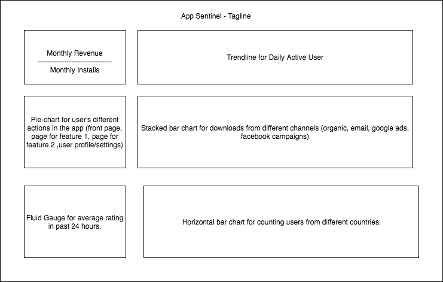

# App Watcher

### Background

App Watcher is a dashboard that takes in live data and interact with different charts.

### Functionality & MVP  

In this dashboard, it should has features below:

- [ ] all charts are displayed correctly and easy to read
- [ ] a user can click on the charts to view details
- [ ] a user can update some of the charts with checkbox/dropdown menu

In addition, this project will include:

- [ ] A production Readme

### Wireframes

This app will consist of a single screen with game status, game controls, and nav links to my Github / LinkedIn.

### Architecture and Technologies

This project will be implemented with the following technologies:

- Vanilla JavaScript and `jquery` for overall structure and game logic.
- `D3.js` for visualization.
- Webpack to bundle and serve up the various scripts.

### Implementation Timeline

**Day 1**: Setup all necessary Node modules, including getting webpack up and running and `D3.js` installed.  Create `webpack.config.js` as well as `package.json`.  Write a basic entry file and the bare bones of scripts outlined above.  Learn the basics of `D3.js`.  Goals for the day:

- Get a green bundle with `webpack`
- Learn enough `D3.js` to render an object to the `Canvas` element

**Day 2**: Get data ready, get the first two charts displaying correctly.

**Day 3**: Get the rest of the charts displaying correctly.

**Day 4**: Styling of the charts.

### Bonus features

There are many directions this cellular automata engine could eventually go.  Some anticipated updates are:

- [ ] Offer an "add" button to let users create a chart themselves.
- [ ] Charts are draggable.