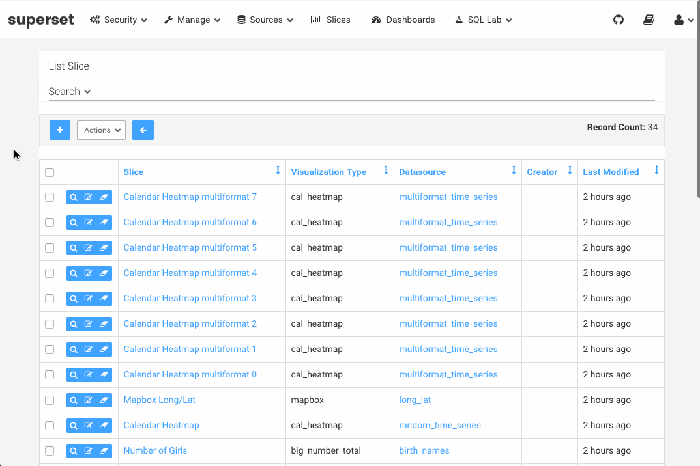
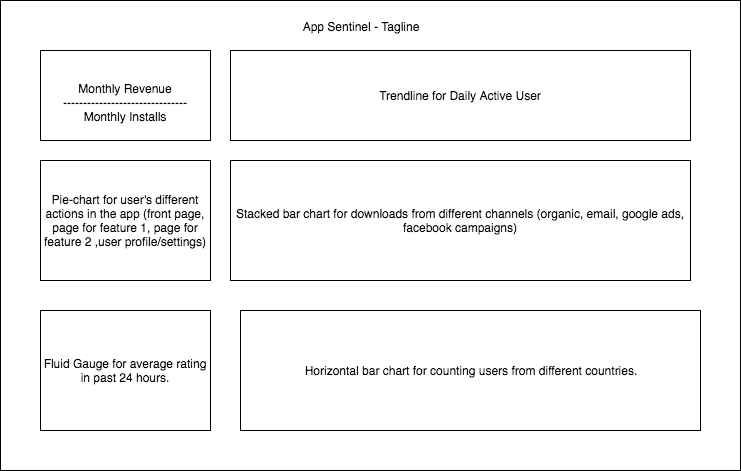

# App Sentinel

### Background

All the mobile companies understand the performance of their apps are critical to their success. The growth hackers care a lot about user activities, the marketeers care a lot about cost/downloads efficiency, and the engineers care a lot about high availability and low latency. 

App Sentinel is a dashboard that is designed to visualize the most important metrics for certain domain. In this case, I choose growth hacking - the topic I'm more familiar with.

App Sentinel takes in live data and present different levels of details interactively. For now it uses randomly generated data to emulate that process but it would be easy to be plugged with a real-time data source.

A dashboard should serve its purpose to make its consumer understand intuitively. But to specific, the ulmate goal is to build a visualization tool like Airbnb's Superset, in which user can select the value to display on x-axis and y-axis, and perform arbitrary aggregation functions like users do in a SQL query.

And yes, we can do interactive data visualization with D3 like [this](http://bl.ocks.org/anupsavvy/9513382) and [this](http://bl.ocks.org/diethardsteiner/3287802).

### Functionality & MVP  

In this dashboard, it should has features below:

- [ ] all charts are displayed correctly and easy to read
- [ ] a user can click on the charts to view details
- [ ] a user can update some of the charts with dropdown menu

In addition, this project will include:

- [ ] A production Readme

### Wireframes

This app will consist of a single screen with game status, game controls, and nav links to my Github / LinkedIn.

### Architecture and Technologies

This project will be implemented with the following technologies:

- Vanilla JavaScript for data .
- `D3.js` for visualization
- bootstrap to give it some responsiveness.

File structure:

-- docs

-- lib

 - main.js (entrance file)
 - chart_x.js (for each visualization)
 
-- application.css

-- index.html

### Implementation Timeline

**Day 1**: Setup all necessary Node modules, including getting webpack up and running and `D3.js` installed.  Create `webpack.config.js` as well as `package.json`.  Write a basic entry file and the bare bones of scripts outlined above.  Learn the basics of `D3.js`.  Goals for the day:

- Get a green bundle with `webpack`
- Learn enough `D3.js` to render an object to the `Canvas` element

**Day 2**: Get data ready, get the first two charts displaying correctly.

**Day 3**: Get the rest of the charts displaying correctly.

**Day 4**: Styling of the charts.

### Bonus features

There are many directions this cellular automata engine could eventually go.  Some anticipated updates are:

- [ ] Offer an "add" button to let users create a chart themselves.
- [ ] Charts are draggable.
